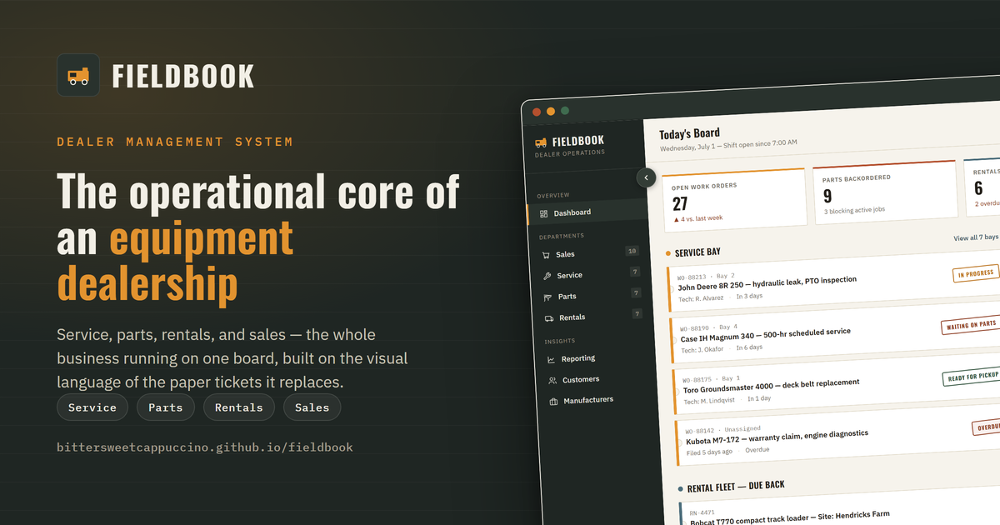

# Fieldbook — A Dealer Management System Concept

**A product concept exploring the operational core of an equipment dealership: service, parts, rentals, sales, and manufacturer integrations in one system.**

**View the interactive mockup →** https://bittersweetcappuccino.github.io/fieldbook/

---

## Why this project

I built this after reading a Product Manager job posting for a company that builds dealer management software (DMS/ERP) for agriculture, construction, and turf equipment dealerships — the kind of vertical, unglamorous B2B software that runs on 40 years of institutional habit and a lot of paper.

Rather than just tailor my resume to the role, I wanted to think through the product itself: what does "own the research, ideation, development, and improvement of a dealer management system" actually mean day to day? What's the workflow underneath the job description? Building the concept was a way to test my own understanding of the domain.

## The problem space

Equipment dealerships aren't retail. A single sale can involve financing, a trade-in, a manufacturer allocation, and a multi-week delivery window. A single repair can involve a technician, a bay, a warranty claim filed with the manufacturer, and a part that's backordered for three weeks. The business runs across five departments that all touch the same piece of equipment at different points in its life — sales, service, parts, rentals — and historically, dealerships tracked all of it on **physical work order tickets and service tags**.

That's the insight the concept is built around: a DMS replacing a paper system that already has a visual language people trust — tickets, stamps, tags, statuses.

## Design approach

**Grounding in the subject.** Instead of designing "a dashboard," I designed a shop floor. The signature UI element is a torn-ticket card — perforated edges, a department-coded stripe, a rotated ink-stamp status badge (*Ready*, *In Progress*, *Waiting on Parts*, *Overdue*). It's a direct translation of the paper work order into a digital component, so a service manager who's spent 20 years reading paper tags can read the screen in the same glance.

**Color as department.** Amber for service, green for parts, steel blue for rentals, clay for sales-critical alerts. The color isn't cosmetic — it's a wayfinding system, the same way a dealership might color-code job tags by department.

**Typography built for a shop.** A condensed industrial display face (Oswald) for headers reads clearly at a glance from a distance — the way you'd need to read a status board on a shop wall. Monospace for part numbers and work order IDs, because those need to be scannable and unambiguous. A plain, high-legibility sans for body text and dense data.

**Structure.** The five modules on the dashboard — service bay board, parts alerts, rental fleet, sales pipeline, manufacturer sync feed — map directly to the responsibilities, including the often-overlooked manufacturer relationship/integration piece, which is specific to how dealer networks work (allocations, warranty claims, co-op programs all flow through the OEM relationship).

## Product thinking behind the surface

- **The dashboard leads with what's blocking work.** Open work orders, backordered parts, overdue rentals, and pipeline value are the four numbers that tell a GM whether today is going fine or going sideways.
- **Overdue states use both color and a stamp label, never color alone**, since this is a screen used in bright shop-floor lighting and glanced at, not read closely — redundant signaling matters more here than in a typical office SaaS product.
- **The manufacturer feed is transactional, not a notification dump.** Each line is an event with a business consequence (credit posted, shipment ETA, claim flagged), because in this world, a stalled manufacturer sync directly blocks a technician's ability to close a job.

---

## Associated work

- **[User Flows for the Shop Floor](https://bittersweetcappuccino.github.io/fieldbook/docs/user-flows.html)** — a routing board that maps every real path through the mockup across all five departments.
- **[Pressure Test: Fieldbook's Sync Feed vs. a Real OEM API](https://bittersweetcappuccino.github.io/fieldbook/docs/pressure-test.html)** — an addendum that stress-tests the manufacturer sync feed against John Deere's public developer documentation, and what each constraint changes in the product.

---

*Built as a product/UI concept exercise, not built for or affiliated with any specific company. Tech: HTML/CSS/JavaScript/Claude Code.*
